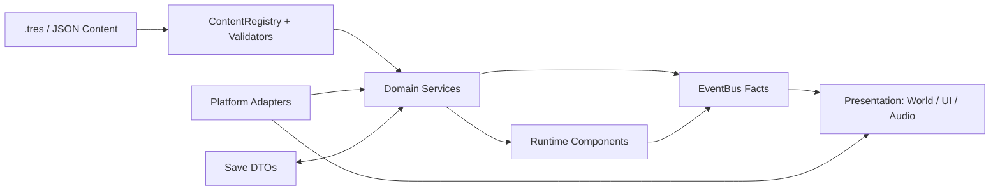
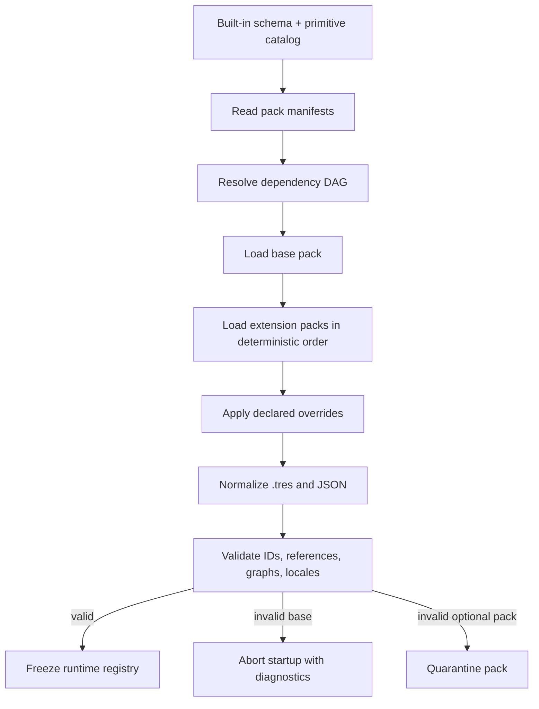
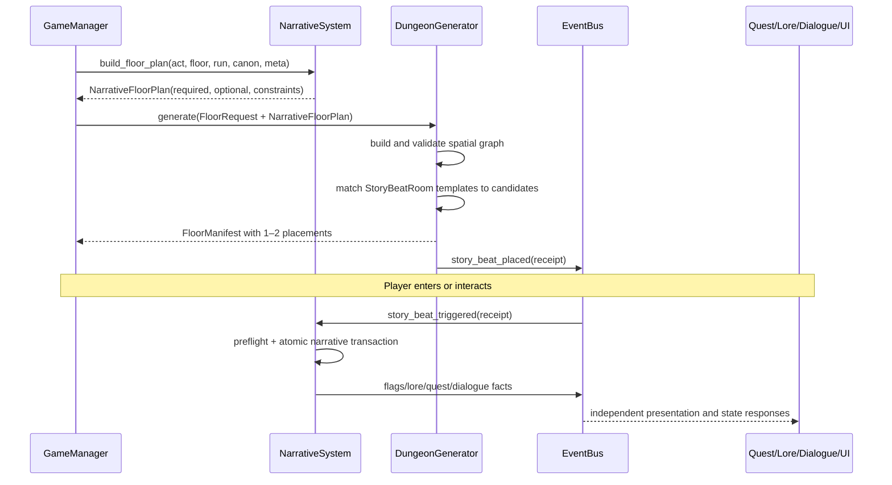
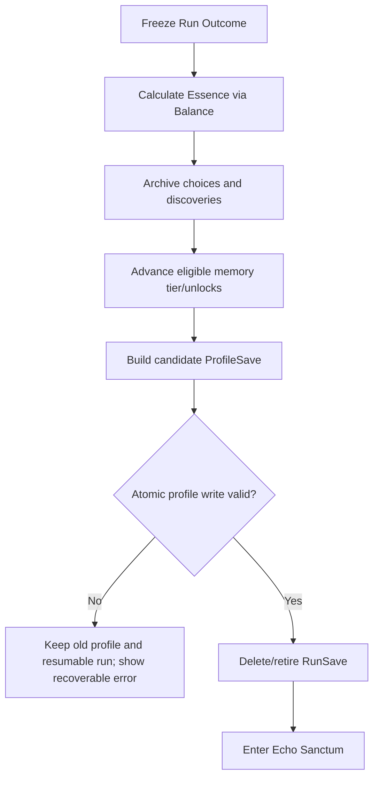

# Architecture

> **Project:** Echoes of the Shattered Veil / 破碎帷幕的回响
> **Document status:** Foundation baseline 0.1
> **Minimum engine:** Godot 4.3.x
> **Internal resolution:** 480×270, 32×32 world grid
> **Canonical design spec:** `docs/superpowers/specs/2026-07-10-project-foundation-design.md`

本文档是项目工程边界的权威说明。它描述系统如何协作、数据如何进入运行时、哪些模块拥有哪类状态，以及社区扩展内容时应遵循的契约。实现与本文冲突时，应先提交 Architecture Decision Record（ADR）并更新本文，而不是让例外悄悄沉积在代码中。

## Architectural Goals and Non-Goals

### Goals

1. **普通内容扩展不改核心代码。** 新敌人、物品、效果、词缀、Biome、房间、对话、Lore、Quest、StoryBeat、NPC 变体与 Ending 通过 `.tres` 或 JSON 添加；它们组合经审核的通用 primitive。
2. **战术与叙事共享同一事实模型。** Boss 阶段、对话选择、NPC 生死、Lore 证据和结局资格均由稳定 ID、typed flags 与事件回执连接，不以 UI 文本或场景路径暗中耦合。
3. **运行可复现。** 同一内容版本、根种子与玩家命令序列应得到相同地牢、AI 决策、掉落和叙事房间计划。表现层随机性使用独立种子流，不影响领域结果。
4. **严格离散回合。** 玩家等待输入时世界不推进；速度、行动成本、状态 tick 与 Boss phase 在 Energy Timeline 中有明确顺序。
5. **存档可迁移、失败可恢复。** Profile 与 Run 分离，写入有校验、备份和显式 migration chain；permadeath 是原子事务。
6. **双语从源头一致。** 逻辑只引用 localization key；简体中文与英文 key 集合必须一致，缺失译文在内容验证阶段失败。
7. **最低兼容 Godot 4.3。** 不使用 4.4+ 专属 API。桌面、Web 与 Android 共用领域代码，平台差异只存在于 adapter 与 export 配置边界。
8. **可观察、可测试。** 所有重要状态转换产生结构化回执；生成、剧情图、引用、迁移和数值公式都可在 headless 环境验证。

### Non-goals

- 不允许内容包执行任意 GDScript、JavaScript、动态 `eval` 或未经注册的表达式。
- 不以深继承树表达敌人差异；Actor 由 Node2D shell 与 Component 组合。
- 不让 UI、动画、音频或 TileMap 成为战斗、任务、库存、叙事或存档的事实来源。
- 不在领域系统中查询操作系统、触屏、安全区或渲染后端。
- 不承诺在一个版本内让任意 mod 覆盖所有核心定义；override 必须在 manifest 中显式声明并通过兼容性校验。
- 不为未来可能需要的玩法预建通用脚本语言。新的 engine primitive 必须有两个以上真实内容用例、测试和文档。
- 不以“死亡次数”本身替代叙事进展；死亡只提供新理解的机会，关键推进来自发现、选择和关系。

## Dependency Rules

依赖方向必须从易变的外层指向稳定的内层：



- **Content layer** 描述“是什么”：定义、ID、条件、命令、生成规则和本地化 key。
- **Domain layer** 决定“发生什么”：验证命令、推进时间线、执行事务并产生事实。
- **Runtime components** 持有实体本地状态，向领域系统发出意图；不得私自解析跨实体规则。
- **Presentation layer** 决定“如何显示”：监听事实与只读状态，播放动画、更新 UI、写入可见消息。
- **Platform adapters** 把触摸、窗口、安全区和文件能力转换成领域可理解的接口。

需要立即返回结果且只有一个明确拥有者的操作使用直接命令调用，例如 `InventorySystem.try_equip(request) -> TransactionResult`。已经发生、可能有多个消费者的事实使用 `EventBus` typed signal，例如 `item_equipped(receipt)`。不得用 signal 模拟同步 RPC，也不得由多个系统同时写同一状态。

依赖通过显式注入、稳定 Autoload API 或经校验的 ID 建立。禁止任意 `get_tree().root.find_child()`、按节点名发现服务、从 UI Control 反向读取规则状态，以及把 mutable Dictionary 当作跨模块公共模型。

## Project Structure

```text
addons/                    固定版本的编辑器与测试插件
assets/                    原始表现资产；不承载玩法规则
  audio/                   music、ambient、sfx
  fonts/                   像素字体与许可证
  lore_art/ portraits/     幻象插图与对话肖像
  sprites/ tilesets/ ui/   32px world art 与像素 UI
content/base/              内建 JSON 内容包
  manifest.json            pack 身份、版本、依赖、override
  localization/            zh_CN 与 en 目录
  dialogues/ lore/         文本或图结构内容
  schemas/                 JSON Schema 与 pack schema
resources/                 强类型 Godot Resource 内容
  entities/ items/ effects/ affixes/
  biomes/ dungeon/ tiles/ balance/ meta/
  narrative/               quests、endings、npcs、story_beats 等
scenes/                    可实例化表现与组合 shell
  bootstrap/ components/ entities/ dungeon/
  world/ hub/ narrative/ ui/
scripts/                   规则、服务、组件与 adapter
  autoload/ core/ components/ combat/ dungeon/
  entities/ input/ inventory/ narrative/ save/ ui/ utilities/
tests/                     unit、integration、content 与 migration fixtures
tools/                     内容校验、导入器、release 工具
docs/                      ADR、设计规格和实施计划
```

`resources/` 中的 `.tres` 适合 Inspector 直接编辑、强类型嵌套与纹理/音频引用；`content/` 中的 JSON 适合大量双语文本、对话图、版本控制与 mod pack。两种来源经过 `ContentRegistry` 归一化后向消费者暴露同一种只读 definition。消费者不能通过扩展名判断内容来源。

资产路径不是内容 ID。移动 `res://assets/sprites/actors/veil_hound.png` 不应改变 `base.enemy.veil_hound` 的语义身份。引用资产的 Resource 可以变化，但存档、任务和事件只保存稳定 ID。

## Data-Driven Content Pipeline

### Stable ID grammar

推荐格式为 `<pack>.<domain>.<semantic_name>`，例如：

- `base.enemy.veil_hound`
- `base.item.weapon.ashglass_sabre`
- `base.effect.status.memory_bleed`
- `base.story.act1.caedmon_oath`
- `base.dialogue.hub.maelin_after_first_death`
- `base.flag.canon.caedmon_memory_returned`

ID 使用小写 ASCII、数字、点和下划线。显示名称、文件名与翻译不参与身份。重命名 ID 是存档迁移，不是普通重构。

### Load and normalization order



Pack manifest 声明 `schema_version`、`pack_id`、内容版本、游戏版本范围、依赖与 override 列表。缺少声明的重复 ID 是 fatal；override 只能覆盖 manifest 明列的 ID，并必须满足被覆盖 definition 的 schema family。加载顺序不能依赖文件系统枚举顺序。

归一化对象应为 typed Resource 或 typed value object，并在 registry freeze 后视为不可变。运行时状态另存在 Component、domain state 或 save DTO 中，绝不写回 definition。

### Validation gates

启动前和 CI 中至少验证：

1. manifest schema 与版本范围；
2. ID 格式、唯一性和 dependency DAG；
3. Resource 类型、必填字段、数值范围和资产路径；
4. 所有稳定 ID 引用是否存在且 domain 相容；
5. spawn table 权重、Biome 深度、房间约束与 fallback；
6. Dialogue graph 入口、可达节点、合法跳转与终止路径；
7. Quest transition graph、循环策略与 terminal stage；
8. Condition graph 类型与 flag 声明；
9. Narrative command 参数和事务可应用性；
10. Ending 条件是否可解析且没有未知 scope；
11. `zh_CN` 与 `en` key parity、非空文本和 UI 长度警告；
12. 存档 schema migration fixture 是否可读。

诊断必须带 `pack_id`、content ID、源文件、JSON pointer 或 Resource property、错误代码和建议。例如：`CONTENT_REF_MISSING pack=ashfall id=ashfall.quest.smith path=/steps/2/reward_id target=ashfall.item.tempered_echo`。

### Safe condition and command primitives

Condition graph 只有 `ALL`、`ANY`、`NOT` 三种组合节点，以及注册的 typed leaf：flag comparison、relationship threshold、lore ratio、NPC state、quest stage、death archive fact、Act/floor、background、inventory tag、run outcome 和 meta unlock。禁止字符串求值。

Narrative command catalog 包含 `set_flag`、`adjust_relationship`、`reveal_lore`、`advance_quest`、`play_vision`、`queue_story_beat`、`unlock_meta`、`grant_by_id`、`remove_by_tag` 与 `emit_message`。命令 batch 先完成全部引用与前置条件检查，再在快照上执行；任何命令失败则整批回滚并记录 transaction ID。

Gameplay effects 同样由有限 primitive 组合：damage、heal、move、teleport、apply/remove status、spawn、summon、modify energy、modify stat、interact tile、emit narrative hook。通用 primitive 负责规则；内容只提供参数和组合。

### Hot reload

热重载只在 editor/debug build 开启。`ContentRegistry` 先构造候选 registry、完整校验，再原子替换；失败时继续使用旧 registry。正在运行的实体不会自动改变 definition，除非对应系统明确支持 snapshot rebind。Release build 禁止从未签名外部目录热加载，以避免 Web/Android 不一致和任意内容注入。

## Autoload Services

Autoload 是领域入口，不是“全局杂物箱”。每个服务应有小型 public API、typed signals/receipts 和可替换的内部实现。

| Service | Owns | Must not own | Key inputs / outputs |
|---|---|---|---|
| `EventBus` | typed signals 与连接约定 | 玩法状态、命令路由、节点缓存 | facts in signal payloads |
| `GameManager` | application/run 状态机、场景切换、暂停、死亡协调 | 伤害公式、地牢算法、UI 控件 | `start_run`, `end_run`, lifecycle receipts |
| `DungeonGenerator` | seed stream、空间图、房间/走廊、连通性、placement manifest | 剧情资格、任务推进、渲染 | `FloorRequest -> FloorManifest` |
| `CombatSystem` | 行动验证、Energy Timeline、伤害/状态结算、命令回执 | 背包存储、动画、AI 决策树 | `CombatCommand -> CombatReceipt` |
| `InventorySystem` | ownership、stack、equipment、item transaction | Item definition、HUD、战斗动画 | `InventoryCommand -> TransactionResult` |
| `UIManager` | overlay 栈、焦点、输入上下文、HUD presentation 协调 | authoritative gameplay state | open/close requests, view models |
| `NarrativeSystem` | typed story flags、beat eligibility/scheduling、叙事事务、ending evaluation | 空间生成、对话渲染、Codex UI | story facts, `NarrativeFloorPlan` |
| `DialogueManager` | graph traversal、可见 choice、choice submission | 关系值真相、文本排版 | dialogue session/view model |
| `QuestSystem` | quest instance 与合法 stage transition | 世界生成、奖励渲染 | quest commands/receipts |
| `LoreSystem` | discovery set、Codex state、completion metrics | 原始翻译目录、Journal Control | lore receipts/read models |
| `MetaProgressionSystem` | Echo Essence、永久解锁、memory tier、background、NG+ gate | 本轮物品、实际 save I/O | unlock commands/meta receipts |
| `ContentRegistry` | pack loading、normalization、immutable lookup、validation reports | 运行时实体状态 | ID lookup, typed queries |
| `SaveSystem` | serialization、migration、checksum、atomic I/O、backup | 领域规则、死亡奖励公式 | save/load result objects |
| `Logger` | structured records、sink、severity/category filtering | 玩家消息日志文案 | `LogRecord` |
| `Balance` | 纯数值公式、balance resource snapshot、debug reload | 状态存储、随机种子 ownership | typed formula inputs/outputs |
| `InputAdapter` | 键鼠/手柄/触屏到 semantic intent、输入上下文 | 行动是否合法、回合推进 | `PlayerIntent` |

Autoload 初始化顺序为基础设施（Logger、ContentRegistry、EventBus、SaveSystem、Balance）、领域服务、GameManager、UIManager。任何服务在 `_ready()` 中访问尚未就绪的服务都应视为设计错误；Bootstrap 后续负责分阶段初始化并返回状态。

## EventBus Contracts

Signal 名称描述已发生事实，使用过去式语义；命令不通过 `EventBus` 广播。连接由订阅者在进入/退出生命周期时成对管理。重复连接必须可检测，释放节点后不得残留 Callable。

Payload 使用 typed RefCounted receipt、Resource snapshot、枚举或稳定 ID。除明确限定为当前 scene 的表现事件外，不传 mutable Node。Payload 中包含 `event_id`、`run_id`、`turn_index` 和适用的 `source_id`，便于追踪。

初始 catalog：

| Domain | Facts |
|---|---|
| Run | `run_started`, `floor_requested`, `floor_generated`, `run_ended`, `permadeath_resolved`, `hub_entered` |
| Turn | `actor_became_ready`, `action_committed`, `turn_advanced`, `timeline_paused_for_player` |
| Combat | `damage_resolved`, `healing_resolved`, `status_applied`, `actor_defeated`, `boss_phase_changed` |
| Inventory | `item_acquired`, `item_consumed`, `item_equipped`, `inventory_transaction_failed` |
| Narrative | `story_beat_placed`, `story_beat_triggered`, `story_flag_changed`, `memory_vision_started`, `ending_qualified` |
| Dialogue | `dialogue_started`, `dialogue_line_presented`, `dialogue_choice_committed`, `dialogue_ended` |
| Quest | `quest_started`, `quest_stage_changed`, `quest_resolved` |
| Lore | `lore_discovered`, `codex_completion_changed` |
| Meta | `echo_essence_changed`, `meta_unlock_granted`, `memory_tier_changed` |
| Save | `save_started`, `save_succeeded`, `save_failed`, `migration_applied` |
| UI | `message_enqueued`, `overlay_opened`, `overlay_closed`, `input_context_changed` |

避免 “万能” signal 如 `state_changed(Dictionary)`。事实粒度应足以让订阅者只响应所需变化，又不把内部实现逐字段泄露。高频动画事件可在 scene-local mediator 内处理，不污染全局 bus。

## Entity and Component Model

Actor 是 Node2D scene shell，提供 identity、grid position、definition ID 与 component 容器；能力来自子 Component：

- `HealthComponent`：current/max health、死亡阈值与 health snapshot；
- `CombatComponent`：攻击/防御参数和可用 action ID；
- `EnergyTimelineComponent`：speed、current energy、ready state；
- `StatusComponent`：stack、duration、tick policy 与 immunity tags；
- `AIComponent`：behavior profile、blackboard 与 intent 选择；
- `InventoryComponent`：本实体 inventory handle；
- `DialogueComponent`：dialogue actor ID 和可用 graph references；
- `NarrativeTriggerComponent`：进入、交互、受伤、phase 等 hook 到 StoryEvent ID；
- `VisualComponent`：sprite/animation/audio 表现引用，不决定规则。

Component 只拥有本地状态和生命周期。`HealthComponent` 不直接播放死亡动画；它提交/接收领域结算并由 `actor_defeated` 事实驱动表现。`AIComponent` 只选择 intent，不修改目标生命或移动 TileMap。跨组件协调由 Actor facade 或领域服务完成，避免组件互相向上查找。

组合示例：

- Player：Health + Combat + Energy + Status + Inventory + player intent adapter + NarrativeTrigger。
- Veil Hound：Health + Combat + Energy + Status + chase AI + Visual。
- Sanctum NPC：Dialogue + NarrativeTrigger + Visual；是否可战斗由数据决定。
- Caedmon：Health + Combat + Energy + Status + phase AI + Dialogue + NarrativeTrigger + boss Visual。

Definition 选择 component loadout、初始参数、tags、scene shell、drops、AI profile 和 narrative hooks。新增敌人若只使用既有行为，不创建新脚本或 subclass。

## Energy Timeline and Combat Boundary

时间线使用整数能量。建议初始 readiness threshold 为 1000，由 balance resource 定义；Actor 根据 speed 获得能量，达到阈值后可提交 action。Action data 声明 energy cost，因此轻武器、重击、蓄力、移动、加速与迟缓共享一个模型。

确定性调度规则：

1. 计算到下一 Actor ready 所需的最小离散推进；
2. 同一时间 ready 时按显式 initiative、stable spawn sequence、entity ID 排序；
3. 若轮到玩家，时间线暂停，直到收到合法 `PlayerIntent`；
4. 命令先验证 range、LOS、energy、status、target 和 tile；
5. 使用 run seed 的 combat 子流解决 hit/crit/proc；
6. 依顺序执行 effect primitive，产生不可变 `CombatReceipt`；
7. 状态按定义的 `before_action`、`after_action` 或 `timeline_step` tick；
8. 处理 defeat、phase transition 与 narrative hook；
9. 扣除 cost，继续调度。

非法命令不消耗时间。AI 收到同样的 command validation，不能绕过玩家规则。Boss phase 是 data-defined phase graph：条件可读取生命比例、召唤物状态和 narrative flags，进入 phase 触发注册命令；不得把 phase 阈值硬编码在 Boss scene。

CombatSystem 不拥有装备列表；它从 InventorySystem 获取已冻结的 combat loadout snapshot。Damage、armor、crit、status chance 和 Essence 公式集中在 `Balance`，且函数无副作用。动画可以异步播放，但不能延迟或重新决定领域结算；表现完成后只影响输入解锁。

## Dungeon, FOV, and Narrative Room Injection

每层使用互不污染的 seed streams：layout、room variation、spawn、loot、narrative placement 与 cosmetics。根 seed、内容版本和各 stream counter 写入 `FloorManifest`。

基础生成流程：

1. 根据 BiomeResource 选择 BSP bounds、room range、corridor policy 和 cellular decorators；
2. BSP 生成主要房间与走廊图；
3. Cellular Automata 仅在允许区域塑造洞穴边缘，不破坏关键连接；
4. 验证入口、出口、Boss、秘密候选与所有 required anchor 可达；
5. 分配房间 tags、深度、entrance count、危险预算与 spawn sockets；
6. 请求并注入 NarrativeFloorPlan；
7. 放置敌人、elite、trap、loot、环境交互和 secret；
8. 最终 flood-fill、最短路径、占位冲突与预算校验；
9. 生成只读 FloorManifest，表现层据此实例化。

FOV 由独立 visibility service 使用对称 shadowcasting 计算。Tile property 数据声明 opacity 和 light behavior。当前可见、已探索记忆与从未见区域分开保存；表现层只读取 VisibilitySnapshot。敌人 AI 的感知使用规则化 LOS/听觉服务，不从玩家屏幕的 FOV texture 推断。

### Narrative room injection



NarrativeSystem 选择“本层应出现什么”，DungeonGenerator 决定“空间上放在哪里”。`NarrativeFloorPlan` 评估 Act、floor、typed flags、relationship、quest、已见 history、exclusion group、cooldown 和 meta variant。每层至少一个 required beat；存在合格内容时增加一个 optional/relational beat。

StoryBeatRoom 约束包括 biome tags、depth band、最小尺寸、入口数、距楼梯范围、Boss adjacency、isolation、secret 和替换/装饰策略。required beat 必须声明 fallback template 与 anchor policy。首选匹配失败时使用 fallback 并记录 structured warning；不得静默省略。Placement 结果含 beat ID、template ID、坐标、选择原因和 seed receipt，便于复现。

## Narrative Runtime

叙事状态严格分三种 scope：

- **Run State**：当前种子、楼层、临时 relationship delta、run-local NPC outcome、已消费 beat、选择与遭遇；permadeath 后归档摘要并清除。
- **Echo Memory**：死亡归档、Echo Essence、永久解锁、已知 Lore、memory tier、记住的对话、background、Act variant 与 NG+。
- **Story Canon**：关键决定、持久 NPC fate、Quest milestone、truth discovery 与 Ending qualification。

每个 flag 有 definition：ID、value type、scope、default、可选 range/enum 和写权限。内容不能在运行时创造未声明 flag。关系值也使用声明的 NPC relationship track 和 clamp policy。

Dialogue graph 节点类型为 Line、Choice、Gate、Command、Jump、End。每个 node 有稳定 ID；可见 choices 先运行 condition，提交后执行 narrative command transaction。显示文本只通过 localization key 读取，不写入 save。DialogueManager 负责 traversal，NarrativeSystem 拥有 flag/relationship mutation，UIManager 只呈现 view model。

Quest 使用显式 stage transition graph。重复进入、失败、放弃和多结局 stage 必须由 definition 声明。QuestSystem 不通过“设置任意整数”推进；它验证 current stage、trigger 和目标 transition，成功后产生 receipt。

EndingResource 包含 ending ID、优先级、condition graph、variant selectors、所需 NPC survival/autonomy、lore threshold 和 finale sequence。NarrativeSystem 在明确 checkpoint 评估资格，保存 explanation receipt，避免最终 UI 与系统采用不同条件。

叙事事务流程为：构建命令 → 解析所有 ID → 预检 scope/type/transition → 创建受影响状态快照 → 顺序应用 → 校验不变量 → commit → 发出 facts。失败时回滚并记录 transaction ID、失败 command index 与 source StoryEvent。

## Persistence and Migration

存档位于 `user://`，逻辑格式跨桌面、Web 和 Android 一致。分为：

- `ProfileSave`：Echo Memory、Story Canon、设置、Codex、永久 unlock、已见结局与版本信息；
- `RunSave`：根 seed、FloorManifest references、Actor snapshots、timeline、inventory、当前 quests、run-local flags 与命令序列 checkpoint。

写入协议：

1. 领域系统构造 immutable save DTO；
2. SaveSystem 验证 schema 与引用；
3. 序列化到临时文件；
4. 重新读取并校验 checksum；
5. 旧正式文件移动/复制为 last-known-good backup；
6. 临时文件原子替换正式文件（平台能力不足时使用有日志的安全替代）；
7. 发出 `save_succeeded` receipt。

读取时先检查 schema version 和 checksum；失败则尝试 backup。Migration 是 `vN -> vN+1` 的纯转换链，每一步有 fixture、输入 hash 和输出验证。禁止“如果字段不存在就猜”的无限兼容分支。内容 ID rename 通过 migration map 显式处理。

### Permadeath transaction



只有 profile 成功落盘后才清除 RunSave 并返回 Hub。应用崩溃不能造成“角色已死但 Essence 与故事进度都丢失”的半事务状态。

## Balance, Logging, and Error Handling

`Balance` 暴露纯函数和只读 BalanceResource snapshot。所有公式接收明确 typed inputs，不读 scene tree、singleton mutable state 或随机全局。示例接口包括 damage after armor、hit chance、status chance、energy gain、enemy budget by depth、affix budget、Essence reward 和 lore threshold。Debug hot reload 构造新 snapshot 并完整校验后替换；当前命令继续使用开始时捕获的旧 snapshot，避免半次结算跨版本。

结构化 `LogRecord` 至少包含 timestamp、severity、category、code、message、run ID、turn、content ID、source path 和 context fields。Severity：

- DEBUG：seed stream、候选筛选和性能细节；
- INFO：生命周期与重要事务成功；
- WARN：已使用安全 fallback、optional pack 被隔离；
- ERROR：请求失败但旧状态可恢复；同时调用 `push_error` 供 Godot 调试器发现；
- FATAL：base schema、core save 或不可恢复不变量失败，阻止进入错误状态。

玩家 Message Log 与工程 Logger 分离。前者是本地化、可读的 combat/narrative 文本；后者是诊断记录。不能把 exception 文本直接展示给玩家，也不能把诗意消息当作错误证据。

错误策略：base pack 无效则拒绝启动 run；optional pack 无效则隔离整个 pack 并展示诊断；required StoryBeat 空间匹配失败则使用声明 fallback；save 写失败保留旧文件；非法玩家/AI command 返回失败 receipt 且不消耗回合。任何 fallback 都必须可观察，禁止静默吞错。

## UI and Cross-Platform Input

UIManager 管理 overlay stack、焦点、输入上下文和 view model 生命周期。HUD 显示生命/能量、简洁 minimap、状态和最近消息；Inventory、Dialogue、Codex、Map、Message History 与 Hub 使用 overlay，避免永久压缩约 15×8 tile 的主视野。

Pixel UI 规则：整数 Control 坐标、nearest atlas、无 filter、无非整数缩放、像素字体、9-slice 边界对齐、肖像和 typewriter 文本使用确定的 clipping。480×270 是设计基准；屏幕无法提供整数倍时保持宽高比并 letterbox。触屏按钮位于安全区，主游戏区域不因刘海/圆角改变逻辑 viewport。

`InputAdapter` 把键盘、手柄与触摸转换为 `PlayerIntent`。Project actions 提供八方向、wait、confirm/cancel、inventory、character、codex、map、message、quick slots、zoom 和 pause。摇杆/触摸先量化 cardinal vector，再合成为八方向；domain 只接收 grid direction。输入上下文阻止对话 choice 同时触发战斗行动。

平台边界：

- Windows/macOS/Linux：键鼠与手柄，窗口/全屏切换不得改变内部 viewport；
- Web：使用 `user://` 的浏览器持久化适配，音频解锁和页面失焦在 adapter 处理；
- Android：landscape、触屏 overlay、back action、安全区和生命周期保存；
- 所有平台共用 GL Compatibility，release shader 必须通过 WebGL 2/GLES 3 限制。

## Testing Strategy

测试金字塔：

1. **Content validation**：最快，验证 JSON/Resource schema、ID、引用、locale parity、Dialogue/Quest/Ending graph。
2. **Unit tests**：Balance pure functions、condition evaluator、command transaction、timeline ordering、inventory rules、save migration。
3. **Property/seed tests**：大量固定 seed 验证地牢连通、required beat 数量、spawn budget、FOV 对称性和 deterministic manifest hash。
4. **Integration tests**：从 start run 到 floor generation、战斗、死亡事务、Hub 对话和 ending evaluation。
5. **Scene/UI tests**：focus、overlay、触摸意图、文本溢出与无缺失资源。
6. **Platform smoke tests**：Godot 4.3 与新稳定版 headless import；各导出 artifact 启动；关键 viewport screenshot hash/visual review。

测试不能依赖系统时间、全局随机或文件枚举顺序。每个失败应输出 seed、content version 和最小 receipt trail。保存 migration 使用不可修改 fixture；生成 property failure 保存复现 seed。

当前 foundation contract 使用 Python 标准库，确保尚无 Godot test addon 时仍可检查目录、配置和文档。进入 GDScript 阶段后固定测试框架版本并 vendor/lock，CI 不从浮动分支获取依赖。

## Extension Guide

### Add a monster without code

1. 在 `resources/entities/` 创建 EntityDefinition `.tres`，分配 namespaced ID、tags、stats、32px visual、component loadout。
2. 引用已有 AI profile、actions、effects、loot table 与 narrative hooks。
3. 把 ID 加入 Biome spawn table，并声明 depth/weight/budget。
4. 添加 `zh_CN` 与 `en` 名称、描述、combat message keys。
5. 运行 content validator、seed spawn test 与 headless import。

若需要的“行为”只是 patrol/chase/ranged/summon/phase 的参数组合，不新增脚本。只有无法由两个以上实际敌人共享的 primitive 不足才提出 engine ADR。

### Add an item, affix, or effect

创建对应 typed Resource；Effect 组合注册 primitive，Item 只引用 effect IDs。词缀声明 allowed tags、tier、budget、互斥 group、stat/effect modifiers 和双语 keys。运行 cycle detection、装备 transaction 与 balance budget 测试。禁止在 item scene 的 `_ready()` 修改玩家属性。

### Add a biome or room

BiomeResource 定义 tile theme、generation ranges、危险预算、spawn/loot tables、ambient keys 和 narrative tags。RoomTemplate 提供逻辑 tile/property map、sockets、entrance tags 与 placement constraints；视觉层引用 TileSet。运行连通性、所有 entrance rotation 和 32px alignment 测试。

### Add dialogue or lore

Dialogue JSON 使用稳定 graph/node ID、localization key、Condition 和 NarrativeCommand；Lore metadata `.tres` 引用 JSON 正文 keys、source perspective、Act/reveal tier、关联证据与 unlock。校验 entry 可达、choice 有合法终点、两个 locale 完整且无提前泄露的 reveal tag。

### Add a quest or StoryBeat

QuestResource 定义 stage graph、transition trigger、condition、command batch、fail/terminal states。StoryBeatResource 定义 eligibility、cooldown、exclusion、required/optional、room constraints、fallback template 和 trigger commands。通过模拟 story state 校验可达路径，再以多 seed 验证每层 1–2 个 placement。

### Add an NPC variant

不复制 NPC 核心脚本。新增 Dialogue graph/variant selector、relationship thresholds、appearance Resource 和 StoryBeat 条目；NPC definition 仍组合 DialogueComponent 与 NarrativeTriggerComponent。所有 survival/autonomy flags 预先声明并由 NarrativeSystem 管理。

### Add an ending

EndingResource 提供 ID、condition graph、priority、mutual exclusion、variant selector、required finale sequence 和 localization keys。添加 validator fixture 覆盖 qualified、不 qualified 和 competing ending；NarrativeSystem 使用解释回执报告每个条件结果。UI 不自行重算。

### When engine work is justified

提案必须回答：现有 primitive 为什么无法组合；至少两个内容用例；新增 API 与禁止职责；失败模式；序列化/迁移影响；Godot 4.3/Web/Android 兼容；测试和文档。批准后先实现 primitive 与 validator，再提交内容，避免 one-off content code。

## CI, Versioning, and Release Design

版本采用 SemVer。最终单一版本源写入机器可读文件并同步 `application/config/version`；release tag 为 `vMAJOR.MINOR.PATCH`。Workflow 必须在任何导出前确认 tag 去掉 `v` 后与项目版本完全一致，预发布 tag 与版本 metadata 使用明确策略，不允许“tag 是 1.2.0、游戏仍显示 1.1.0”。

CI 顺序：

1. checkout（含固定依赖）；
2. JSON/Resource schema、ID、引用、图和 locale parity；
3. Python/GDScript unit 与 integration；
4. Godot 4.3 和较新稳定版 headless import；
5. deterministic seed suite 与 save migration fixtures；
6. tag/version gate；
7. 使用固定 Godot export templates 导出 Windows、macOS、Linux、Web、Android；
8. smoke test 可运行 artifact，生成 SHA-256；
9. 上传 workflow artifacts；
10. 仅 semantic tag job 创建 GitHub Release、附带 changelog、五平台包和 checksums；
11. 使用 `gh release view` 或 API readback 验证资产、tag、commit 和公开状态。

建议 artifact 名：

- `echoes-of-the-shattered-veil-vX.Y.Z-windows-x86_64.zip`
- `echoes-of-the-shattered-veil-vX.Y.Z-macos-universal.zip`
- `echoes-of-the-shattered-veil-vX.Y.Z-linux-x86_64.tar.gz`
- `echoes-of-the-shattered-veil-vX.Y.Z-web.zip`
- `echoes-of-the-shattered-veil-vX.Y.Z-android.apk`
- `echoes-of-the-shattered-veil-vX.Y.Z-SHA256SUMS.txt`

Repository 写操作使用最小权限 `GITHUB_TOKEN`，Android signing、Apple signing/notarization 等 secrets 只在受保护 release environment 中可用，fork PR 不暴露。没有 signing 能力时，CI 仍验证 unsigned development artifacts，但 release policy 必须清楚标记，不可伪称已签名。

最终本地发布通过已认证 `gh` 完成：确认 repo owner/remote、push 已验证 commit 与 tag、观察 workflow 成功、读取 Release assets。任何发布失败保留 tag 状态并提供恢复步骤；不得删除已有 Release 来掩盖版本冲突。
