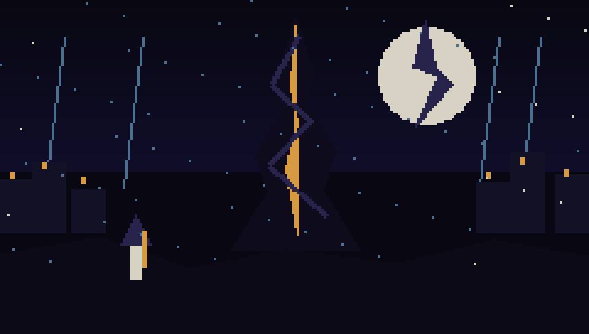

# Echoes of the Shattered Veil · 破碎帷幕的回响

A bilingual, data-driven, narrative roguelike built with Godot 4.3. Enter a living tower that rebuilds itself from memory, survive strict turn-based encounters, and decide whether painful truth should be repaired, released, ruled, or carried together.

一款使用 Godot 4.3 开发的中英双语、数据驱动叙事 roguelike。进入一座会依照记忆重构自身的活体尖塔，在严格回合制战斗中生存，并决定痛苦的真相应被缝合、释放、统治，还是共同承担。



## v0.1.1 Act I vertical slice

- Procedural multi-floor Ashen Narthex with narrative-room injection
- Permadeath loop returning to Echo Sanctum with persistent Echo Essence
- Energy-timeline combat, equipment, affixes, statuses, traps, elites, and multiple AI profiles
- FOV and explored-map memory
- Branching Maelin dialogue, six lore threads, memory visions, a quest, and the Caedmon story Boss
- Bilingual Chinese/English UI and story content
- Keyboard, gamepad, and touch-oriented semantic input
- Data-authored entities, items, effects, dialogue, lore, quests, StoryBeats, and endings

## Controls

| Action | Keyboard |
|---|---|
| Move | `Q W E / A D / Z S C` |
| Wait | `V` |
| Confirm / Cancel | `Space` / `X` |
| Inventory / Codex / Map | `I` / `L` / `M` |
| Message history | `H` |
| Pause | `P` |

The UI exposes touch controls on mobile-sized displays. Gamepad cardinal input is combined into eight-way grid movement.

## Run locally

1. Install Godot 4.3 or newer.
2. Clone the repository.
3. Open `project.godot` and run the main scene.

Headless verification:

```bash
godot --headless --editor --path . --quit
godot --headless --path . res://tests/integration/test_runner.tscn
python3 -m unittest discover -s tests -v
```

## Architecture and content authoring

- [`ARCHITECTURE.md`](ARCHITECTURE.md) — service boundaries, Components, data flow, persistence, generation, and release design.
- [`NARRATIVE_BIBLE.md`](NARRATIVE_BIBLE.md) — canon, four Acts, cast, reveals, endings, and bilingual voice.
- [`DATA_TEMPLATES.md`](DATA_TEMPLATES.md) — practical `.tres` and JSON templates.
- [`TODO.md`](TODO.md) — prioritized roadmap.
- [`CONTRIBUTING.md`](CONTRIBUTING.md) — contribution and validation workflow.

All ordinary content is authored through custom Godot Resources or JSON and resolved by stable namespaced IDs. Content files never execute arbitrary code or dynamic `eval` expressions.

## Builds and website

Tagged semantic versions trigger reproducible GitHub Actions exports for Windows, macOS, Linux, Web, and Android, then publish checksums and a latest GitHub Release. The project website is deployed through GitHub Pages from `site/`.

## License

Code, documentation, and generated project artwork are available under the [MIT License](LICENSE).
